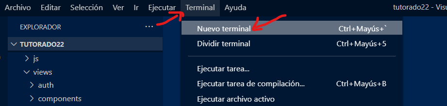
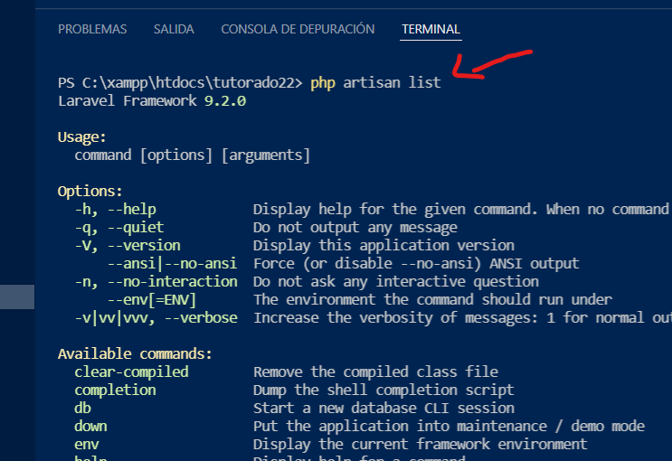

# Artisan. La consola de Laravel

Artisan es la interfaz de línea de comandos incluida en Laravel. (CLI, Command line interface). 

Puedes usar el clásico CMD o la terminal que viene integrada en VSCODE para acceder al Artisan.



Puedes ver la lista de comandos disponibles con _php artisan list_



## En la consola Artisan...

Lista de comandos disponibles.
```
php artisan list
```

Muestra las rutas disponibles en el proyecto.
```
php artisan route:list
```

Crea un controlador.

```
php artisan make:controller AnecdotaController
```

Crea un controlador con "recursos" asociados. Estos recursos son los métodos para hacer un CRUD.

```
php artisan make:controller AnecdotaController --resource
```

Crea un controlador con un modelo asociado.

```
php artisan make:controller AnecdotaController -m Anecdota
```

Crea un modelo.

```
php artisan make:model Anecdota
```

