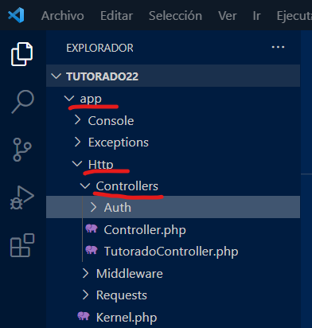

# Controladores en Laravel

Los Controladores son clases que llevan la lógica de la aplicación.

Se ubican en la ruta _app/http/controllers_  



## En la consola Artisan...

Abre una consola. Puedes usar el clásico CMD o la que viene integrada en VSCODE.

Crea un controlador

```
php artisan make:controller AnecdotaController
```

Crea un controlador con "recursos" asociados. Estos recursos son los métodos para hacer un CRUD.

```
php artisan make:controller AnecdotaController --resource
```

Crea un controlador con un modelo asociado.

```
php artisan make:controller AnecdotaController -m Anecdota
```

## Convenciones...

- El nombre siempre inicia en mayúsculas. _Ej. AnecdotaController_.
- Incluye siempre el sufijo "Controller" aunque no es obligatorio.
- Puedes tener los controladores que desees, no están sujetos a tablas como los modelos.
- Al crearlo con un "resource" no es necesario usar todos los métodos creados.
- Aunque puedes usar los nombres que quieras para las acciones de un CRUD, deberías usar los sugeridos.
