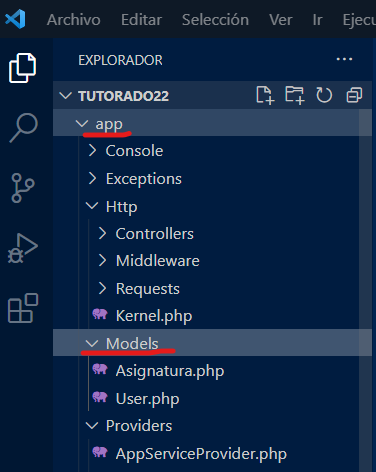

# Modelos en Laravel

Los modelos son representaciones de las tablas de la base de datos asociada al proyecto. 

Se ubican en la ruta _app/models_ 



## En la consola Artisan...

Crea un modelo

```
php artisan make:model Anecdota
```

## Convenciones...

- El nombre siempre inicia en mayúsculas. _Ej. Anecdota_
- Es el nombre en singular de la tabla. En la BD es en plural.
	- Esta diseñado para el inglés, donde el plurar solo es agregar la "s".
	- Funcionará en casos como: _modelo anécdota, tabla anécdotas_
	- Fallará en casos como: _modelo perfil, tabla perfiles_
	- Para que no falle usarías _modelo perfil, tabla perfils_
	- Lo ideal para no "escribir mal" sería usar los nombres en inglés.
- Usa nombres en inglés para no complicarte con los plurales.
- Puedes eliminarlo solo borrando el archivo.
