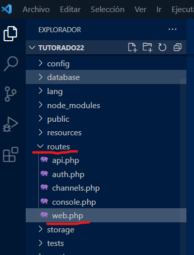

# Rutas en Laravel

Las rutas son las URL por las cuáles se "mueve" la aplicación. Para cada acción del sitio hay una URL asociada. Esta debe estar declarada en las rutas.

Se ubican en la ruta _routes/web_  

## En la consola Artisan...

Las rutas no tienen instrucción para crearse. En el fichero _web_ se declaran las URL que requiere el proyecto.

## Convenciones...

- Si un contenido de la aplicación es estático puede indicarse directamente en la ruta. _Ej. http://localhost/sugerencias_. Entendiendo que las sugerencias son un listado de texto estático.
- En caso de que la url deba cargar información dinámica deberá pasa por un controlador. _Ej. http://localhost/anecdota/23_. En este caso la anécdota dependerá del valor numérico que esté en la URL. 