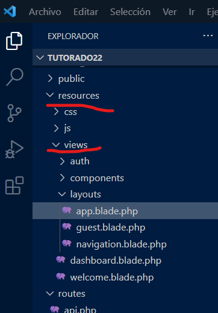

# Vistas en Laravel

Las vistas son las páginas visibles del proyecto. 

Se ubican en la ruta _resources/views_  

## En la consola Artisan...

Las vistas no tienen instrucción para crearse. En el directorio de las vistas creas un archivo con extensión _.blade.php_ para que funcione.

## Convenciones...

- La extensión es _.blade.php_ para que se reconozca como una vista.
- Por defecto la vista de inicio es el _welcome.blade.php_.
- En la estructura por defecto de Laravel hay un directorio en _resources/views/layouts/_ que almacena las vistas de plantilla para un proyecto.
- Los nombres pueden ser los que consideres adecuados usando el formato: _CadaPalabraComienzaEnMayuscula.blade.php_.
- Puedes eliminarlo solo borrando el archivo. 