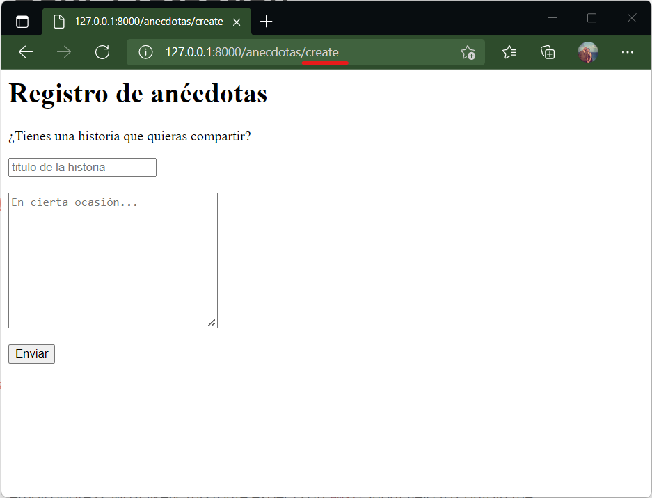

# El método create()

Es la página con el formulario de registro. Si fue creado con _resource_ la URL sería:

| Verb    | URI | Action  | Route Name |
|---------|-----|---------|------------|
| GET | /anecdotas/create | create | anecdotas.create |


## En el controlador...

En este ejemplo el create tendrá un formulario básico para registrar una anécdota. Se puede incluir información dinámica en la vista resultante pero no es forzoso. Todo dependerá del diseño. En este caso solo mostraremos un formulario.

```php #
public function create()
    {
        //
        return view('anecdotas.create');
    }
```

No hay más acciones que la carga de la vista correspondiente.

## En el modelo...

No se requiere ninguna acción pues no hay información dinámica.

## En la vista...

La vista está en el directorio :icon-file-directory: anécdotas con el fichero :icon-file: create en el subdirectorio de las views. Esto por usar la sintaxis "directorio.fichero" que puede verse en la línea 4 con 'anecdotas.create'.

En un código muy simple, el resultado es:

```html #
<h1>Registro de anécdotas</h1>
<p>¿Tienes una historia que quieras compartir?</p>

<form action="/anecdotas" method="POST">
@csrf
<input type="text" name="titulo" placeholder="titulo de la historia" required>
<br><br>
<textarea name="historia" cols="30" rows="10" placeholder="En cierta ocasión..." required></textarea>
<br><br>
<button>Enviar</button>
</form>
```

En este caso el _action_ apunta al método **store()** que es el que guardará en la base de datos el envío realizado en este formulario.

El _action_ utiliza la URI asociada, pero también puede usarse el _route name_ a través del método route().

```php 
<form action="{{route('anecdotas.store')}}" method="POST">
```

La directiva **@csrf** es el token de seguridad. Revise el [CSRF Protection](https://laravel.com/docs/9.x/csrf#main-content) para más información. Con esta línea se provee de seguridad en el envío.

## En la ruta...

No se indica nada más que la ruta al resource una sola vez:

```
Route::resource('anecdotas', AnecdotaController::class);
```

## Resultado

El resultado final al acceder a la URL: 

```
http://127.0.0.1:8000/anecdotas/create
```

