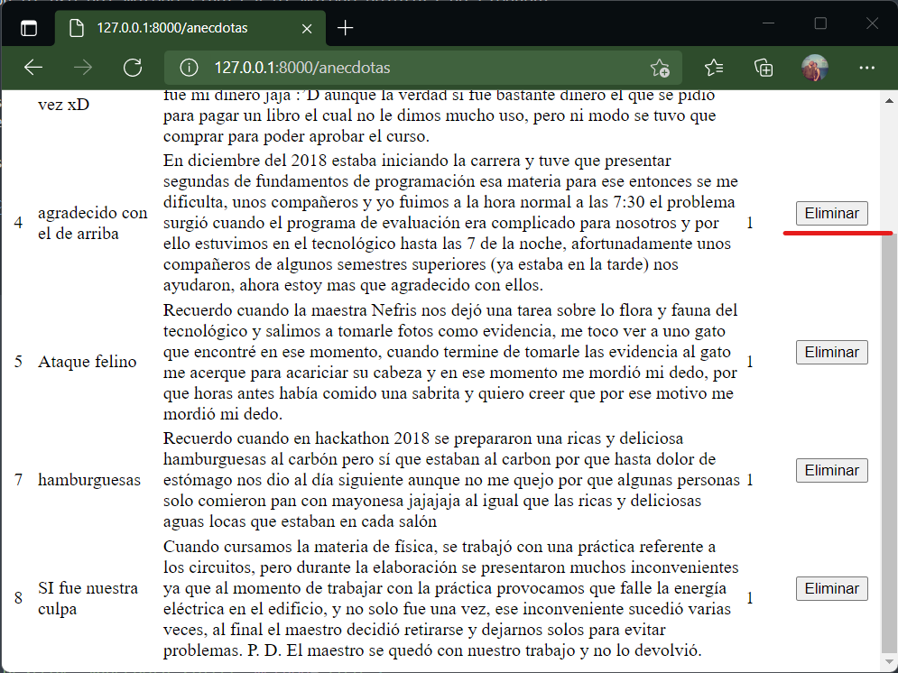

# El método destroy()

Es la página que _muestra_ un registro en particular. Si fue creado con _resource_ la URL sería:

| Verb    | URI | Action  | Route Name |
|---------|-----|---------|------------|
| DELETE | /anecdotas/{anecdota} | destroy | anecdotas.destroy |

Esta URL requiere un dato para funcionar. Esto se indica con {anecdota}.

!!!
Esta operación no se deshace.
!!!

## En el controlador...

En este ejemplo el destroy eliminará el registro seleccionado. Esta acción debe tener una confirmación previa para evitar una _eliminación por error_. En este ejemplo esa confirmación no se aplica.

```php #
public function destroy($id)
    {
        //
        $anecdota=Anecdota::find($id);
        $anecdota->delete();
        return redirect('/anecdotas')->with('exito', 'Eliminación exitosa');
    }
```

Al igual que el _show_, _edit_ y _update_ se requiere el ID del registro a eliminar. Se aplica un _find_ y se aplica el método **delete()**.

Al igual que al actualizar no se crea una vista solo para confirmar sino que se _redirige_ a una vista existente y se publica un mensaje.

## En el modelo...

La acción que usa el modelo está en la línea 4 con el uso del método find() y el método delete() de Eloquent.

## En la vista...

No hay una vista en concreto para la eliminación. Lo común es que sea un **botón** en la vista maestro junto a opciones de ver y editar, o bien, en un _show_ del registro donde se puede decidir si se elimina o no. En otras palabras, es una modificación a las vistas _index_ y _show_ y/o cualquier otra que se haya diseñado para ello.

En este ejemplo se agrega como un botón en la vista index.



En un código muy simple, el resultado es:

```html #
<h1>Todas las anécdotas</h1>

<table>
    <thead>
        <th>ID</th>
        <th>Titulo</th>
        <th>Anécdota</th>
        <th>Autor</th>
        <th>Acciones</th>
    </thead>
    <tbody>
    @foreach ($anecdotas as $anecdota)
        <tr>
            <td>{{$anecdota->id}}</td>
            <td>{{$anecdota->titulo}}</td>
            <td>{{$anecdota->anecdota}}</td>
            <td>{{$anecdota->user_id}}</td>
            <td>
                <form action="{{route('anecdotas.destroy',$anecdota->id)}}" method="POST">
                    @csrf
                    @method('DELETE')
                    <button>Eliminar</button>
                </form>
            </td>
        </tr>
    @endforeach
    </tbody>
</table>
```

El cambio está entre las líneas 19 y 23. Como el método **destroy()** utiliza un método _delete_ para confirmar la solicitud esta debe hacerse a través de un formulario. Se incluye el _@csrf_ cada vez que se envíe información por formularios para la seguridad y el _@method('DELETE')_ para cambiar el método POST por el DELETE. 

!!!
Importante incluir una confirmación de eliminación antes de aplicar este form para evitar errores.
!!!

## En la ruta...

No se indica nada más que la ruta al resource una sola vez:

```
Route::resource('anecdotas', AnecdotaController::class);
```

## Resultado

El resultado final no es visible propiamente, ya que veremos la vista inicial pero sin un registro menos.