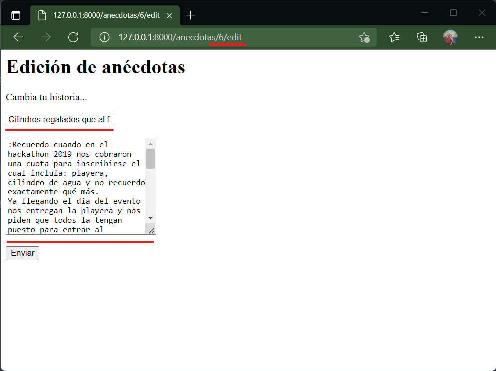

# El método edit()

Es la página que carga el formulario de edición de un registro. Debe haber un registro existente para que esta página funcione. Si fue creado con _resource_ la URL sería:

| Verb    | URI | Action  | Route Name |
|---------|-----|---------|------------|
| GET | /anecdotas/{anecdota}/edit |   edit |   anecdotas.edit |

Esta URL requiere un dato para cargar. Esto se indica con {anecdota}.

## En el controlador...

En este ejemplo el edit mostrará un formulario con los datos precargados de la anécdota que se editará.

```php #
public function edit(Anecdota $anecdota)
    {
        //
        //dd($anecdota);
        return view('anecdotas.edit',['anecdota'=>$anecdota]);
    }
```

El _edit_ es básicamente el método _show_ y _create_ juntos. Debe primero encontrarse el registro y luego cargarlo en el formulario que es igual al de inserción salvo que el diseño sugiera algo distinto.

En este ejemplo en los parámetros que recibe la función se ejecuta un _find()_. El id usado para la consulta está en la URL. De ahí que se carga solo la vista con el registro.  

## En el modelo...

La acción que usa el modelo está en los parámetros de entrada de la función (línea 1).

## En la vista...

La vista está en el directorio :icon-file-directory: anécdotas con el fichero :icon-file: edit en el subdirectorio de las views. Esto por usar la sintaxis "directorio.fichero" que puede verse en la línea 6 con 'anecdotas.edit'.

En un código muy simple, el resultado es:

```html #
<h1>Una anécdota</h1>

<h2>{{$anecdota->titulo}}</h2>
<p><em>{{$anecdota->anecdota}}</em<h1>Edición de anécdotas</h1>
<p>Cambia tu historia...</p>

<form action="{{route('anecdotas.store')}}" method="POST">
@csrf
<input type="text" name="titulo" placeholder="titulo de la historia" value="{{$anecdota->titulo}}" required>
<br><br>
<textarea name="historia" cols="30" rows="10" placeholder="En cierta ocasión..." required>{{$anecdota->anecdota}}</textarea>
<br><br>
<button>Enviar</button>
</form>></p>
<p><a href="">{{$anecdota->user_id}}</a></p>
```

En esta vista lo que cambia con respecto al _create_ es el atributo _value_ que se alimenta con los datos de la variable enviada por el controlador.

## En la ruta...

No se indica nada más que la ruta al resource una sola vez:

```
Route::resource('anecdotas', AnecdotaController::class);
```

## Resultado

El resultado final al acceder a la URL: 

```
http://127.0.0.1:8000/anecdotas/6/edit
```

