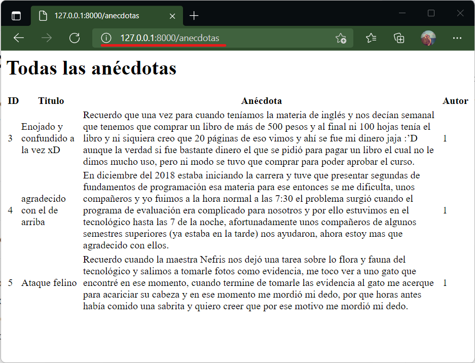

# El método index()

Es la página de inicio del controlador. Para un controlador llamado AnecdotaController el index podría ser una ruta como _localhost/anecdotas/_ donde _anecdotas_ es el nombre del controlador y el _slash_ es el indicador de que estamos en el index. Si fue creado con _resource_ la URL sería:

| Verb    | URI | Action  | Route Name |
|---------|-----|---------|------------|
| GET | /anecdotas | index |  anecdotas.index | 

Esta página podría hacer muchas cosas. Si es el usuario administrador del sitio podría ser la lista de todas las anécdotas disponibles (página maestro) con opciones de edición y eliminación mientras que si es un usuario genérico como el alumno sería la lista de sus anécdotas. También podría ser la lista completa de anécdotas pero solo con opciones de visualización.

## En el controlador...

En este ejemplo el index será una página maestro que mostrará todas las anécdotas registradas en la tabla. 

```php #
public function index()
    {
        //página maestro de las anécdotas
        //método all() regresa todos los registros de un modelo.
        $anecdotas=Anecdota::all();
        //dd($anecdotas);
        return view('anecdotas.anecdotas',['anecdotas'=>$anecdotas]);
    }
```

La línea 5 utiliza un método de [ELOQUENT de Laravel](https://laravel.com/docs/9.x/eloquent). El método all() regresa todos los registros de la tabla. Revise la referencia para más detalles.

Una vez con los datos en la variable local lo enviamos a la vista (línea 7) correspondiente. 

## En el modelo...

La acción que usa el modelo está en la línea 5 con el uso del método all() de Eloquent.

## En la vista...

La vista está en el directorio :icon-file-directory: anécdotas con el fichero :icon-file: anecdotas en el subdirectorio de las views. Esto por usar la sintaxis "directorio.fichero" que puede verse en la línea 7 con 'anecdotas.anecdotas'.

En un código muy simple, el resultado es:

```html #
<h1>Todas las anécdotas</h1>

<table>
    <thead>
        <th>ID</th>
        <th>Titulo</th>
        <th>Anécdota</th>
        <th>Autor</th>
    </thead>
    <tbody>
    @foreach ($anecdotas as $anecdota)
        <tr>
            <td>{{$anecdota->id}}</td>
            <td>{{$anecdota->titulo}}</td>
            <td>{{$anecdota->anecdota}}</td>
            <td>{{$anecdota->user_id}}</td>
        </tr>
    @endforeach
    </tbody>
</table>
```

Como el resultado es un array debe recorrerse usando el método **@foreach** y **@endforeach** para indicar el bloque que se repetirá. El formato de doble llave **{{}}** indica que se mostrará un dato dinámico proveniente de la variable asociada a la vista. Esto es [sintaxis BLADE](https://laravel.com/docs/9.x/blade#main-content). Ver referencia para más detalles.

## En la ruta...

No se indica nada más que la ruta al resource una sola vez:

```
Route::resource('anecdotas', AnecdotaController::class);
```

## Resultado 

El resultado final al acceder a la URL: 

```
http://127.0.0.1:8000/anecdotas
```

