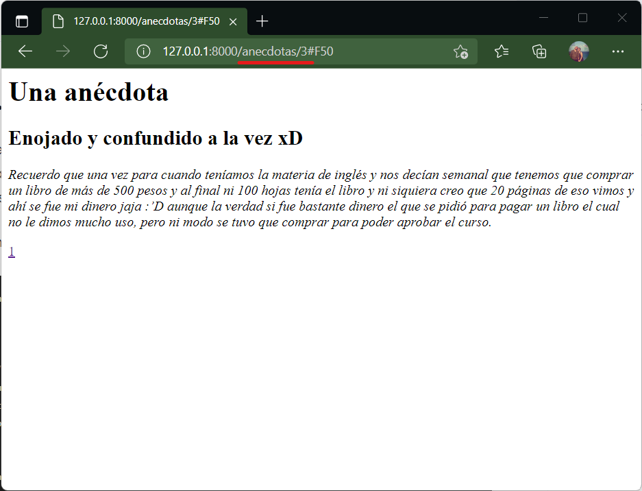

# El método show()

Es la página que _muestra_ un registro en particular. Si fue creado con _resource_ la URL sería:

| Verb    | URI | Action  | Route Name |
|---------|-----|---------|------------|
| GET | /anecdotas/{anecdota} | show |    anecdotas.show |

Esta URL requiere un dato para cargar. Esto se indica con {anecdota}.

## En el controlador...

En este ejemplo el show mostrará una anécdota en particular.

```php #
public function show($id)
    {
        //
        $anecdota=Anecdota::where('id',$id)->first();
        //dd($anecdota);
        return view('anecdotas.show',['anecdota'=>$anecdota]);
    }
```

La línea 4 utiliza un método de [ELOQUENT de Laravel](https://laravel.com/docs/9.x/eloquent). El método **where()** nos permite aplicar un criterio de búsqueda y selección. Como este método regresa un arreglo pero sabemos que solo tiene un único registro aplicamos el método **first()** para obtener el registro único en formato JSON. Para más información ver la referencia.

Una vez con los datos en la variable local lo enviamos a la vista (línea 6) correspondiente. 

!!!
Con un método **where()** obtienes un objeto con el arreglo de datos. Para que sea _legible_ en la vista hay que aplicar un método **get()** que regrese únicamente el arreglo. Utilice también **first()** o **last()** si solo necesita el primer o último registro del array.
!!!

!!!
El método **find()** es más corto para hacer un _show_. La instrucción:

```php 
    $anecdota=Anecdota::find($id);    
``` 

!!!

## En el modelo...

La acción que usa el modelo está en la línea 4 con el uso del método where() y first() de Eloquent.

## En la vista...

La vista está en el directorio :icon-file-directory: anécdotas con el fichero :icon-file: show en el subdirectorio de las views. Esto por usar la sintaxis "directorio.fichero" que puede verse en la línea 6 con 'anecdotas.show'.

En un código muy simple, el resultado es:

```html #
<h1>Una anécdota</h1>

<h2>{{$anecdota->titulo}}</h2>
<p><em>{{$anecdota->anecdota}}</em></p>
<p><a href="">{{$anecdota->user_id}}</a></p>
```

La variable adjunta a la vista no es un arreglo, es un objeto JSON por lo cuál no usamos ciclo y accedemos directamente a cada campo del objeto. Cada campo se llama igual que como se llama la columna de la tabla en la base de datos. Esto es [sintaxis BLADE](https://laravel.com/docs/9.x/blade#main-content). Ver referencia para más detalles.

## En la ruta...

No se indica nada más que la ruta al resource una sola vez:

```
Route::resource('anecdotas', AnecdotaController::class);
```

## Resultado

El resultado final al acceder a la URL: 

```
http://127.0.0.1:8000/anecdotas/3
```

