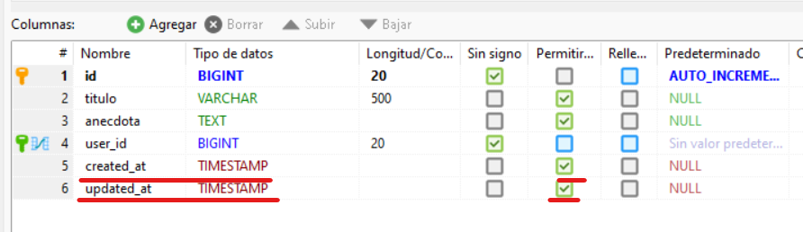
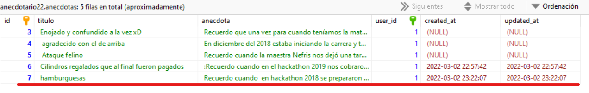

# El método store()

Es la página que _guarda_ un registro en la base de datos. Si fue creado con _resource_ la URL sería:

| Verb    | URI | Action  | Route Name |
|---------|-----|---------|------------|
| POST    | /anecdotas | store |  anecdotas.store |

Esta URL requiere un envío de datos por método POST para funcionar.

## En el controlador...

En este ejemplo el _store()_ registrará una anécdota en la tabla anécdotas. 

!!!
Este ejemplo NO VALIDA los datos de la inserción. En otro ejemplo se utilizará la validación.
!!!

```php #
public function store(Request $request)
    {
        //
        $anecdota= new Anecdota;
        $anecdota->titulo=$request->titulo;
        $anecdota->anecdota=$request->historia;
        $anecdota->user_id=Auth()->user()->id;
        $anecdota->save();
        return redirect('/anecdotas')->with('exito', 'Tu anécdota fue guardada celosamente!');
    }
```

El método recibe el objeto _request_ con los datos enviados por el método POST del formulario _create_. Se crea un objeto basado en el modelo de la tabla anécdotas (línea 4) y se adjuntan a los campos editables del modelo los datos recibidos en el request. No tienen que llamarse igual (línea 6). En la línea 7 se usa un dato que no viene del formulario ya que es el ID del usuario que está haciendo la inserción y ese dato lo tenemos desde su _logueo_. Finalmente se aplica el método **save()** para aplicar la inserción.



!!!
La tabla en la base de datos debe tener los campos _created_at_ y _updated_at_ del tipo _timestamp_ para que funcione esta inserción.
!!!

## En el modelo...

La acción que usa el modelo está en la línea 4 con la acción _new Anecdota_.

## En la vista...

Esta inserción comunmente no genera una página pues solo diría algo como "registro exitoso". Lo común entonces es que se _redireccione_ a una vista existente que confirme la inserción. Un lugar común sería volver al _index_ o al _create_ si queremos ver el resultado o seguir registrando información adjuntando información para dar mensajes de _éxito_. Todo depende del diseño. 

```php #
return redirect('/anecdotas')->with('exito', 'Tu anécdota fue guardada celosamente!');
```

!!!
El método **with()** adjunta un _data flash_ que es un dato que solo _vive_ en la siguiente página que se carga. Se utiliza para mandar mensajes de _éxito_ y _error_ comúnmente. Lleva un nombre y un mensaje.
!!!

!!!
Este mensaje en la redirección aún no se ve en la vista del index. En otro ejemplo se adjuntará.
!!!

## En la ruta...

No se indica nada más que la ruta al resource una sola vez:

```
Route::resource('anecdotas', AnecdotaController::class);
```

## Resultado

El resultado final en la base de datos: 

