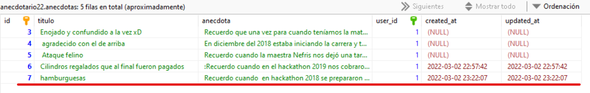

# El método update()

Es la página que _actualiza_ un registro en particular. Si fue creado con _resource_ la URL sería:

| Verb    | URI | Action  | Route Name |
|---------|-----|---------|------------|
| PUT/PATCH  | /anecdotas/{anecdota} | update |  anecdotas.update |

Esta URL requiere un id y la recepción de un _request_ de formulario para funcionar. Esto se indica con {anecdota} y el método PUT. 

## En el controlador...

En este ejemplo el update modificará el título y/o la historia de la anécdota.

```php #
public function update(Request $request, $id)
    {
        // 
        $anecdota=Anecdota::find($id);
        $anecdota->titulo=$request->titulo;
        $anecdota->anecdota=$request->historia;
        $anecdota->save();
        return redirect('/anecdotas')->with('exito', 'Registro exitoso');
    }
```

Se recibe el _request_ del formulario y el ID del registro a actualizar. Se aplica un _find_ para encontrar el registro en la base de datos y se carga el objeto del modelo Anecdota. Se asignan los nuevos valores y se aplica un _save()_ igual que en el método _store_. Lo que cambia es que primero se eligió sobre qué registro existente se guardará de nuevo. Finalmente se reenvía al index del controlador.

## En el modelo...

La acción que usa el modelo está en la línea 4 con el uso del método find() de Eloquent.

## En la vista...

Esta actualización comunmente no genera una página pues solo diría algo como "actualización exitosa". Lo común entonces es que se _redireccione_ a una vista existente que confirme el cambio. Un lugar común sería volver al _index_  para ver el resultado. Todo depende del diseño. 


## En la ruta...

No se indica nada más que la ruta al resource una sola vez:

```
Route::resource('anecdotas', AnecdotaController::class);
```

## Resultado

El resultado final en la base de datos: 

