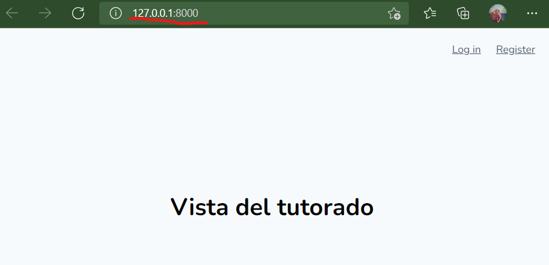
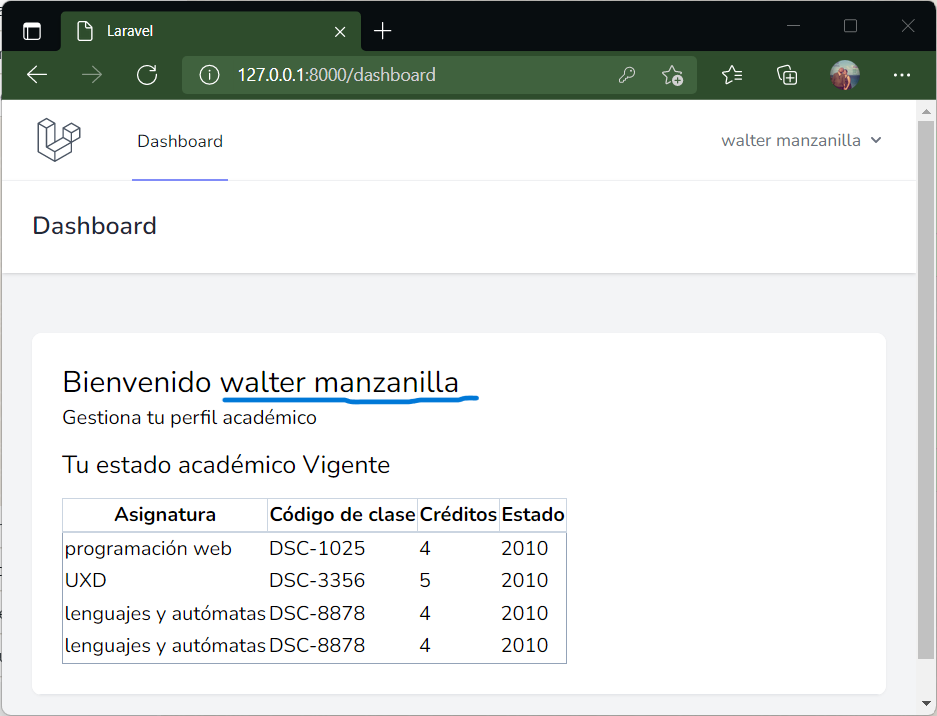
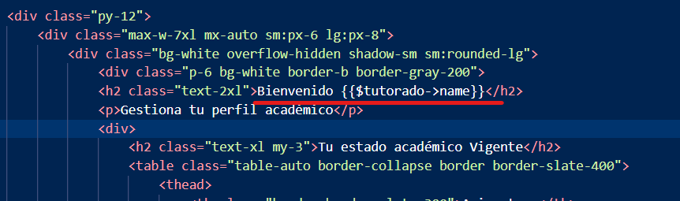

# El Modelo Vista Controlador (MVC)

Es una forma de organizar y estructurar un proyecto de Software separando las múltiples lógicas que este contiene, en términos técnicos MVC es un patrón de arquitectura de Software. Las iniciales MVC significan Model View Controller que en español significan Modelo Vista Controlador.

Si bien hay varios patrones  de arquitectura de Software, uno de los que se hizo más popular es el MVC por la rapidez en disponer de los elementos de cada sección, para acceder a los modelos y unirlos con la Vista por medio de los controladores, por otro lado MVC es muy simple para ordenar un proyecto y cumple muy bien su objetivo.

## Cómo se "relacionan" en Laravel.

La forma simple de describirlo sería: un contenido web (el texto, las imágenes, etc) está en una vista; el acceso a la vista está descrito en la ruta; la ruta indica si es un contenido estático que se accede directamente o si tiene contenido dinámico y requiere pasar por un controlador; el controlador describe las operaciones para manipular datos antes de ser mostrados en la vista y si estos datos vienen de una base de datos entonces el controlador llama al modelo; el modelo sirve como acceso a la tabla de la base de datos de la cuál se está requiriendo información.

### Una página estática.

Considere la página de inicio de laravel: el "welcome". Cuando el usuario accede a la raíz del sitio, el index tradicionalmente, la URL suele ser solo un "slash": / al final del nombre del sitio. Como esta página solo es la bienvenida no posee contenido dinámico que mostrar así que puede indicarse directamente en la RUTA que cargue la VISTA asociada.

La ruta entonces dice:

```
Route::get('/', function () {
    return view('welcome');
});
```



### Una página dinámica.

Considere la página del dashboard. El dashboard es la página que veríamos una vez que iniciemos sesión en una aplicación. Supongamos que en este dashboard desde que entremos queremos ver cierta información que proviene de la base de datos. En consecuencia debemos pasar por un controlador.

La __ruta__ entonces dice:

```
Route::get('/dashboard',[TutoradoController::class,'dashboard'])
			->middleware(['auth'])
			->name('dashboard');
```



> En términos humanos diría algo como: *para acceder al dashboard que tiene el nombre __dashboard__ ve al controlador __TutoradoController__ busca el método __dashboard__, previo comprueba la autorización de acceso con __auth__*.

El __controlador__ tendría un código similar a este:

```
class TutoradoController extends Controller
{
    //
    public function dashboard(){
        $tutorado=Auth()->user();
        //dd($tutorado);
        return view('dashboard',['tutorado'=>$tutorado]);
    }
}
```

 La línea "$tutorado=Auth()->user();" coloca en una variable local la información del usuario _logueado_. Estos métodos de _Auth()_ y _user()_ ya accedieron al __modelo__ para obtener la información por lo que no necesitamos una consulta "explícita" para obtenerla. El "return" carga la vista "dashboard" adjuntando la variable "$tutorado" con la información concerniente al usuario que se ha logueado.

!!!
El método en comentario "dd()" sirve para visualizar el contenido de una variable sin tener que "imprimir" en una vista. 
!!!

 La  __vista__ carga una página html con la información final ya procesada. Las vistas usan la sintaxis BLADE para crear el contenido. 




## Video de referencia

<div style="position: relative; padding-bottom: 56.25%; height: 0;"><iframe src="https://www.loom.com/embed/01a2ad8f02c4448bbe3f93f6355d8b98" frameborder="0" webkitallowfullscreen mozallowfullscreen allowfullscreen style="position: absolute; top: 0; left: 0; width: 100%; height: 100%;"></iframe></div>

[Entendiendo el MVC](https://www.loom.com/share/01a2ad8f02c4448bbe3f93f6355d8b98?sharedAppSource=personal_library)