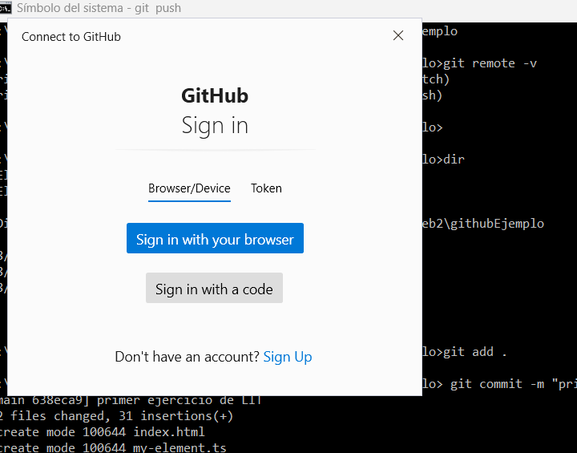

# Actualizando repositorios

Ahora que tienes un repositorio configurado y enlazado puedes trabajar en tu directorio con las herramientas que normalmente usas (VSCODE por ejemplo). Los cambios que realices en tu repositorio local deberán actualizarse en el remoto cuando consideres que deba hacerse. Para eso deberás aplicar un **add** y un **commit** para luego hacer un **push** a la plataforma GITHUB.

El **add** agrega al _envío_ los archivos que quieras _subir_ a la plataforma. El **commit** confirma los cambios que estás enviando. El **push** realiza el envío.

La instrucción **add** debe indicar que archivos quieres enviar. Cuando es TODO usa el operador punto.

La instrucción **commit** lleva un mensaje _-m_ que indica el cambio que estás confirmando con el add.

La instrucción **push** inicia el envío y solicitará una confirmación de usuario la primera vez que conecte de local a remoto. Deberás elegir el **sign in with your browser** para permitir que se conecte. El proceso es automático después de ello.

```cmd
C:\~\githubEjemplo>git add .

C:\~\githubEjemplo> git commit -m "primer ejercicio de LIT"
[main 638eca9] primer ejercicio de LIT
 2 files changed, 31 insertions(+)
 create mode 100644 index.html
 create mode 100644 my-element.ts

C:\~\githubEjemplo>git push
info: please complete authentication in your browser...
Enumerating objects: 5, done.
Counting objects: 100% (5/5), done.
Delta compression using up to 8 threads
Compressing objects: 100% (4/4), done.
Writing objects: 100% (4/4), 744 bytes | 744.00 KiB/s, done.
Total 4 (delta 0), reused 0 (delta 0), pack-reused 0
To https://github.com/walthamtaro/githubEjemplo.git
   9df2f67..638eca9  main -> main

```


A partir de este punto es cuestión de ir confirmando los cambios con ADD, COMMIT y PUSH.