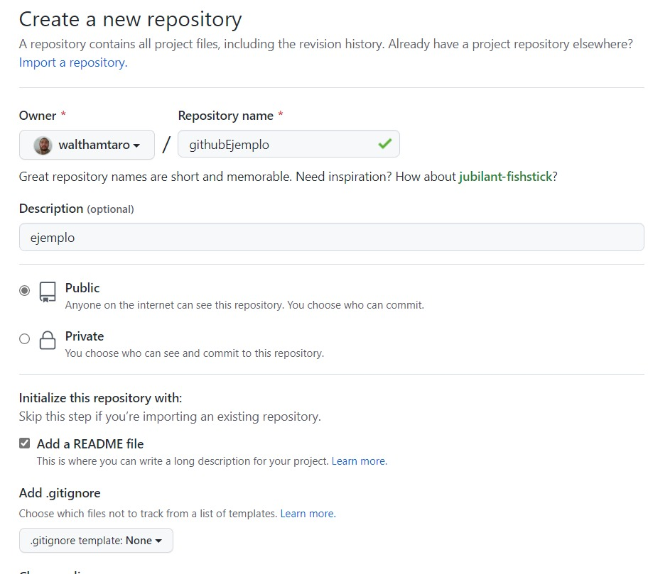
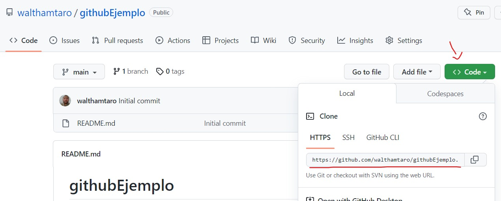

# Creando repositorios

Esta herramienta es útil para llevar el seguimiento de versiones de proyectos de software. Los repositorios permiten la reutilización de código útil en diferentes proyectos y mantener la consistencia e integridad cuando se trabaja en equipo. Ademas conservas copias en línea accesibles desde otros dispositivos y no quedas sujeto a un PC o disco duro en particular.

Para utilizarlo puedes hacerlo desde la web, usando su cliente para Windows o usando **GIT** desde la línea de comandos.

## Primero lo primero

Regístrate e inicia sesión en la plataforma **GITHUB** para tener acceso a sus repositorios.

[!ref target="blank" text="GITHUB"](https://github.com/)

Igualmente descarga e instala GIT para sus acciones por línea de comandos.

[!ref target="blank" text="GIT"](https://git-scm.com/)

## Crea un repositorio local y remoto

Los repositorios son locales y remotos. Los primeros están en tu PC y los segundos en la plataforma GITHUB. Estos deben estar _enlazados_ para mantener la consistencia e integridad. Así cada cambio que se realice en el código puede replicarse en sus copias.

### Crear repositorio en GITHUB

Ahora, en la plataforma GITHUB busca la opción de crear repositorio (botón _new_). Asigna un nombre, marca como público o privado según consideres, agrega el README file y crea el repositorio.



### Clonar el repositorio

Una vez creado el repositorio busca el botón CODE y copia la ruta para _clonar_ y ejecuta en el CMD:



```cmd
C:\Users\~\progweb2\githubEjemplo>git clone https://github.com/walthamtaro/githubEjemplo.git
Cloning into 'githubEjemplo'...
remote: Enumerating objects: 3, done.
remote: Counting objects: 100% (3/3), done.
remote: Total 3 (delta 0), reused 0 (delta 0), pack-reused 0
Receiving objects: 100% (3/3), done.
```

En este punto podrás ver en tu directorio locar el archivo README que indicaste cuando creaste el repositorio.

Para confirmar que tu proyecto está enlazado usa esta instrucción:

```cmd
C:\Users\hamae\~\githubEjemplo>git remote -v
origin  https://github.com/walthamtaro/githubEjemplo.git (fetch)
origin  https://github.com/walthamtaro/githubEjemplo.git (push)
```