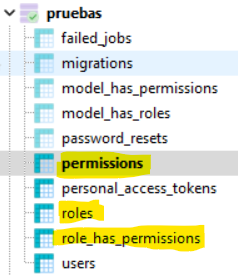
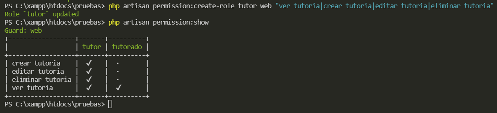
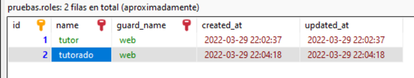
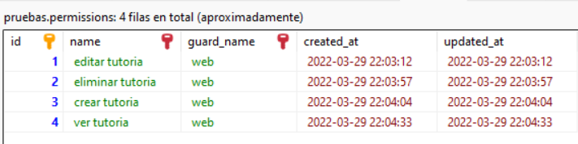
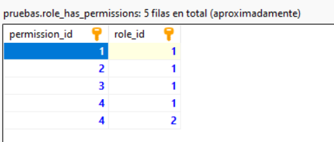

# roles de usuario con SPATIE

El control de roles es una funcionalidad importante en una aplicación con diferentes tipos de usuario. Asignar roles como _editor_, _revisor_, _tutor_ entre otros y definir sus permisos como _edición_ o _eliminación_ de contenido forman parte de este control.

## Usando SPATIE

Existen muchas formas de aplicar control de roles de usuario pero una librería muy utilizada es la de __spatie__. La generación de roles y permisos es muy sencillo desde esta herramienta.

!!!
Consulte la documentación de [spatie](https://spatie.be/) para todas sus funcionalidades.
!!!

Para instalar spatie:

```
composer show spatie/laravel-permission
```

## Creando roles y permisos

Para crear roles y permisos podemos usar _eloquent_ con estas instrucciones:

Crear un rol. En este ejemplo se crea el rol _writer_ para _web_. _web_ es el archivo de rutas que usamos en Laravel.

```
php artisan permission:create-role writer web
```

Crea un permiso. En este ejemplo se crea el permiso _edit articles_ para _web_.

```
php artisan permission:create-permission "edit articles" web
```

Crea un rol con permisos asignados. En este ejemplo se crea el rol _writer_ para _web_ con dos permisos: _create articles_ y _edit articles_. Esta última es la forma más rápida de asignar rol y permiso si ya sabes cuáles son. Puedes repetir la instrucción y actualizarás el registro de roles y permisos, no generará otro nuevo.

```
php artisan permission:create-role writer web "create articles|edit articles"
```

Por último, para ver los permisos y roles creados: 

```
php artisan permission:show
```

## Super usuario

Es común tener un _super usuario_ en la base de datos que tenga acceso a todo y todos los permisos. Esto sería un _gate_ de Laravel. Ver el tema en la sección correspondiente.

En este caso se crea el gate correspondiente y el rol. En este caso se llama _super-admin_. Al rol _super-admin_ no se le asigna ningún permiso porque el _gate_ se los acepta todos.

```
php artisan permission:create-role super-admin
```

El gate

```php #
Gate::before(function ($user, $ability) {
            if ($user->hasRole('super-admin')) {
                return true;
            }
        });
```

## Ejemplo

En estas imágenes puedes ver que tablas se crean con la librería, las instruciones en _eloquent_ usadas y el resultado generado.

Las instrucciones en _eloquent_ en el proyecto:

```#
composer require spatie/laravel-permission
php artisan vendor:publish --provider="Spatie\Permission\PermissionServiceProvider"
php artisan optimize:clear
php artisan migrate
php artisan permission:create-role tutor
php artisan permission:create-permission "editar tutoria"
php artisan permission:create-role tutor web "ver tutoria|crear tutoria|editar tutoria|eliminar tutoria"
php artisan permission:show
```

- Línea 1 instala spatie.
- Línea 2 _publica_ el servicio para que sea _automático_ su uso en el proyecto.
- Línea 3 Limpia la caché para su correcto funcionamiento.
- Línea 4 corre la migración para que las tables se creen en la base de datos.
- Línea 5 Crea el rol _tutor_. No es necesario indicar _web_.
- Línea 6 Crea el permiso _editar tutoria_. No es necesario indicar _web_.
- Línea 7 Crea el rol _tutor_ para _web_ con los permisos _ver tutoria, crear tutoria, editar tutoria y eliminar tutoria_. En este formato debe indicarse _web_ o tendrá inconsistencias.
- Línea 8 Muestra los roles y permisos asignados.










