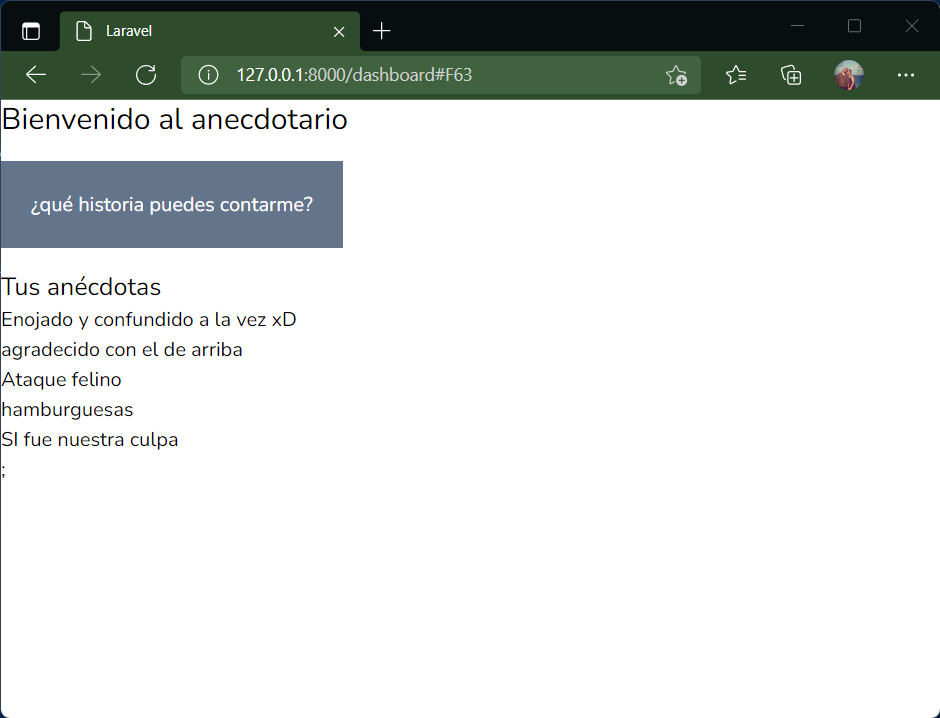

# ¿Qué es Blade?

Blade es un motor de plantillas simple y a la vez poderoso proporcionado por Laravel. A diferencia de otros motores de plantillas populares de PHP, Blade no te impide utilizar código PHP plano en tus vistas. De hecho, todas las vistas de Blade son compiladas en código PHP plano y almacenadas en caché hasta que sean modificadas, lo que significa que Blade no añade sobrecarga a tu aplicación. Los archivos de las vistas de Blade tienen la extensión .blade.php y son usualmente almacenados en el directorio resources/views.

Fuente: [Plantillas Blade – Documentación de Laravel 6](https://styde.net/laravel-6-doc-plantillas-blade/)

Las plantillas en Blade pueden diseñarse usando el formato de _componentes_ o _herencia_. En el caso de los componentes se construyen _fragmentos_ reutilizables en las vistas mientras que en el caso de _herencia_ se usa un documento base al que se agrega nuevo contenido.

## Diseñando plantilla con herencia.

Es la forma primaria en que Laravel construye plantillas. 

```php #
<!-- resources/views/layouts/app.blade.php -->
 
<html>
    <head>
        <title>App Name - @yield('title')</title>
    </head>
    <body>
        @section('sidebar')
            This is the master sidebar.
        @show
 
        <div class="container">
            @yield('content')
        </div>
    </body>
</html>
```

En la [referencia de plantillas blade en Laravel](https://laravel.com/docs/9.x/blade#layouts-using-template-inheritance) puede verse el ejemplo anterior. Considere:

- El __@section()__ indica una sección dinámica en la plantilla. Esta sección puede _cargar_ otro archivo blade en ese _espacio_. El __@yield()__ es algo similar a un _campo_ de dato, en la cuál se _carga_ directamente un contenido. La diferencia sería que _yield_ es el _valor_ del dato que se inserta y _section_ es todo un fragmento de contenidos. En el ejemplo la línea 5 tiene un _yield_ para sustituir el título de la página, un simple texto, mientras que la línea 8 tiene un _section_ para cargar un menú de navegación que es una lista de links. En la línea 10 está la directiva __@show()__ que hace _visible_ la sección.

Dicho de otra forma, el _section_ tiene la _estructura_ del fragmento de contenido que se inserta. El archivo que es insertado indica su propia estructura. En el caso de _yield_ la estructura es definida en el layout así que en el archivo que es insertado no necesariamente indica que es el fragmento.

!!!
El ejemplo anterior es el contenido de la plantilla blade
!!!

Una vez creada la plantilla blade se deben crear entonces las _vistas_ del proyecto que se deben basar en dicha plantilla. En ese caso se utiliza la directiva __@extends()__ que indica que la vista que está creándose es una _extensión_ de otra vista, la que es la plantilla. En otras palabras, la página que crees ahora deberá ser _hijo_ de la página anterior para que _herede_ el diseño.

```php #
<!-- resources/views/child.blade.php -->
 
@extends('layouts.app')
 
@section('title', 'Page Title')
 
@section('sidebar')
    @parent
 
    <p>This is appended to the master sidebar.</p>
@endsection
 
@section('content')
    <p>This is my body content.</p>
@endsection
```

En la página _hijo_ iría el contenido particular de la página. Todas las secciones se indican como __@section()__ ya sea un _yield_ o un _section_ lo que se esté referenciando. En el ejemplo anterior la línea 3 realiza la extensión para indicar que esta página se basa en el archivo _app_ que está en el directorio _layouts_ dentro de la carpeta _views_. La línea 5 muestra cómo se carga contenido en un _yield_, indicando cuál es el nombre del _yield_ primero y segundo el valor que se le quiere asignar. En la línea 7 y hasta la 11 se indica una sección que es nombrada _sidebar_ en la plantilla base. En este fragmento delimitado por _@section()_ y _@endsection()_ se puede colocar todo el código HTML y directivas Blade que se deseen. La línea 8 con la directiva _@parent()_ indica que lo que hubiese escrito en la plantilla base con dicho nombre será sobreescrito por lo que hay en esta sección.

## Ejemplo de plantilla

Usando el ejemplo del anecdotario diseñaremos una plantilla personalizada. 

```html #
<!DOCTYPE html>
<html lang="{{ str_replace('_', '-', app()->getLocale()) }}">
    <head>
        <meta charset="utf-8">
        <meta name="viewport" content="width=device-width, initial-scale=1">
        <meta name="csrf-token" content="{{ csrf_token() }}">

        <title>{{ config('app.name', 'Laravel') }}</title>

        <!-- Fonts -->
        <link rel="stylesheet" href="https://fonts.googleapis.com/css2?family=Nunito:wght@400;600;700&display=swap">

        <!-- Styles -->
        <link rel="stylesheet" href="{{ asset('css/app.css') }}">

        <!-- Scripts -->
        <script src="{{ asset('js/app.js') }}" defer></script>
    </head>
    <body>
       @section('contenido') 

       @show
       
</html>
```

El código anterior es muy básico pero ilustra la idea de una plantilla: la cabecera de la plantilla de ejemplo de laravel se conserva para utilizar _tailwind css_ como herramienta de estilo y el body completo es sustituido por una sección llamada _contenido_. En este caso la página que tenga el contenido deberá incluir toda la estructura de etiquetas correspondientes.

```html #
@extends('layouts.anecdot')

@section('contenido')

<h1 class="text-2xl">Bienvenido al anecdotario</h1>
                    <div class="mt-10">
                    <a href="" class="bg-slate-500 text-white p-6">¿qué historia puedes contarme?</a>
                    </div>
                    <div class="mt-10">
                        <h2 class="text-xl">Tus anécdotas</h2>
                        <ul>
                            @foreach($autor->anecdotas as $anecdota)
                            <li><a href="{{url('/anecdota/{id}',[$anecdota->id])}}">{{$anecdota->titulo}}</a></li>
                            @endforeach
                        </ul>
                    </div>
@endsection
```

El mismo resultado se conseguiría con _yield_ solo que la plantilla debiera indicar la estructura en la cuál se está guardando el contenido. Algo así:

```html #
<!DOCTYPE html>
<html lang="{{ str_replace('_', '-', app()->getLocale()) }}">
    <head>
        <meta charset="utf-8">
        <meta name="viewport" content="width=device-width, initial-scale=1">
        <meta name="csrf-token" content="{{ csrf_token() }}">

        <title>{{ config('app.name', 'Laravel') }}</title>

        <!-- Fonts -->
        <link rel="stylesheet" href="https://fonts.googleapis.com/css2?family=Nunito:wght@400;600;700&display=swap">

        <!-- Styles -->
        <link rel="stylesheet" href="{{ asset('css/app.css') }}">

        <!-- Scripts -->
        <script src="{{ asset('js/app.js') }}" defer></script>
    </head>
    <body>
        <section id="contenidoPrincipal">
            @yield('contenido');
        </section>
    </body>
       
</html>
```

Y la página hijo no tendría cambios:

```html #
@extends('layouts.anecdot')

@section('contenido')


<h1 class="text-2xl">Bienvenido al anecdotario</h1>
                    <div class="mt-10">
                    <a href="" class="bg-slate-500 text-white p-6">¿qué historia puedes contarme?</a>
                    </div>
                    <div class="mt-10">
                        <h2 class="text-xl">Tus anécdotas</h2>
                        <ul>
                            @foreach($autor->anecdotas as $anecdota)
                            <li><a href="{{url('/anecdota/{id}',[$anecdota->id])}}">{{$anecdota->titulo}}</a></li>
                            @endforeach
                        </ul>
                    </div>
@endsection
```
El resultado final sería:

